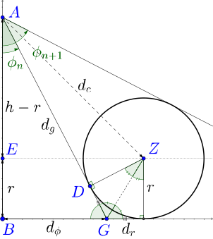
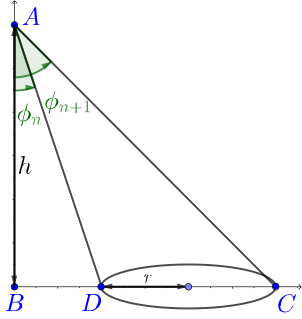
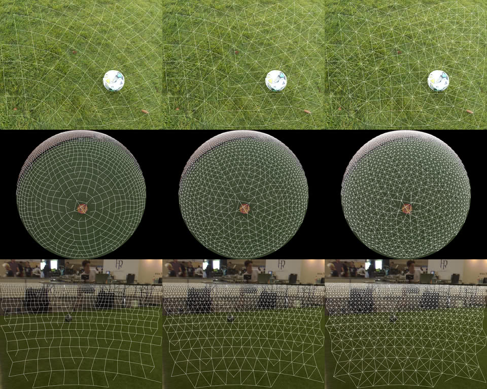
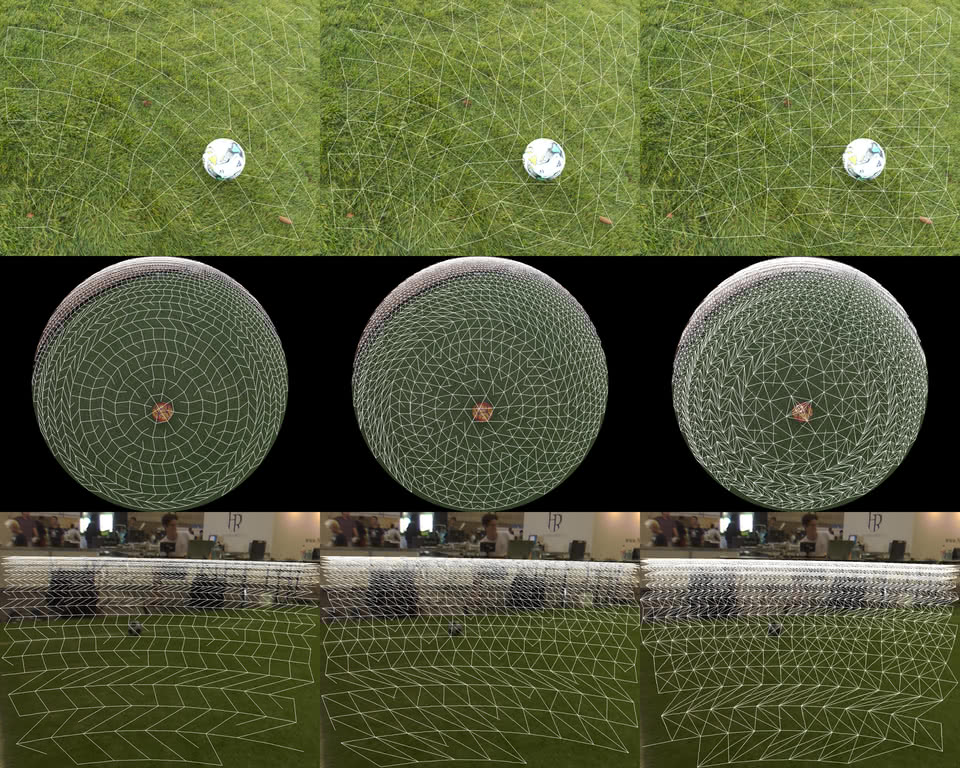
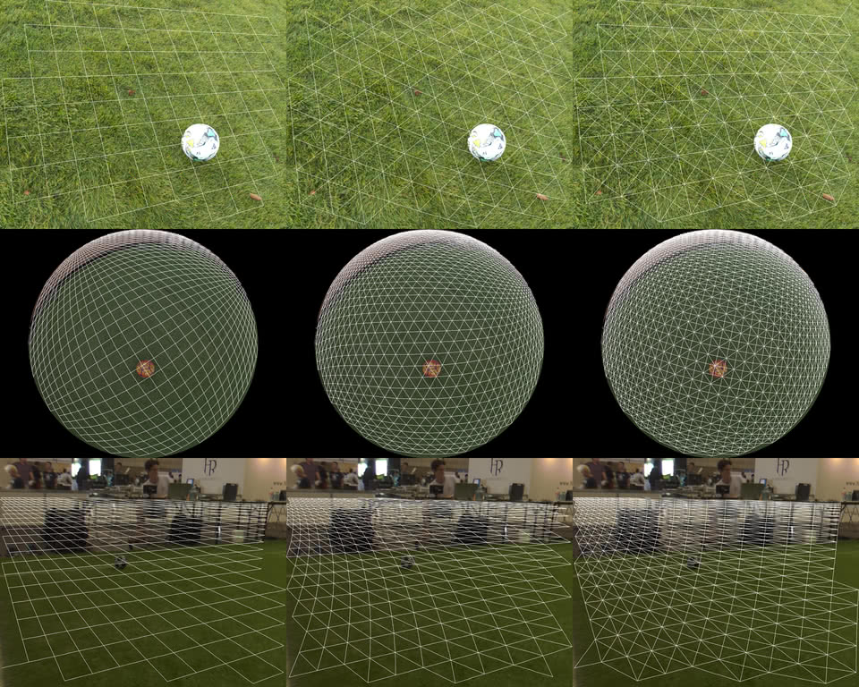
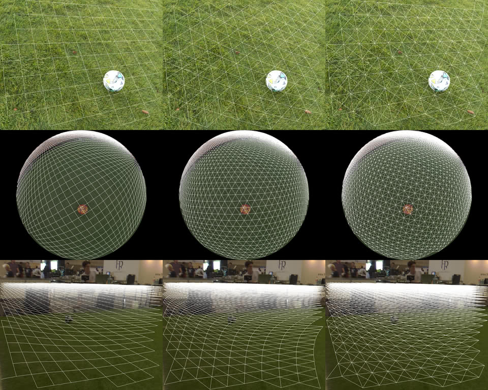
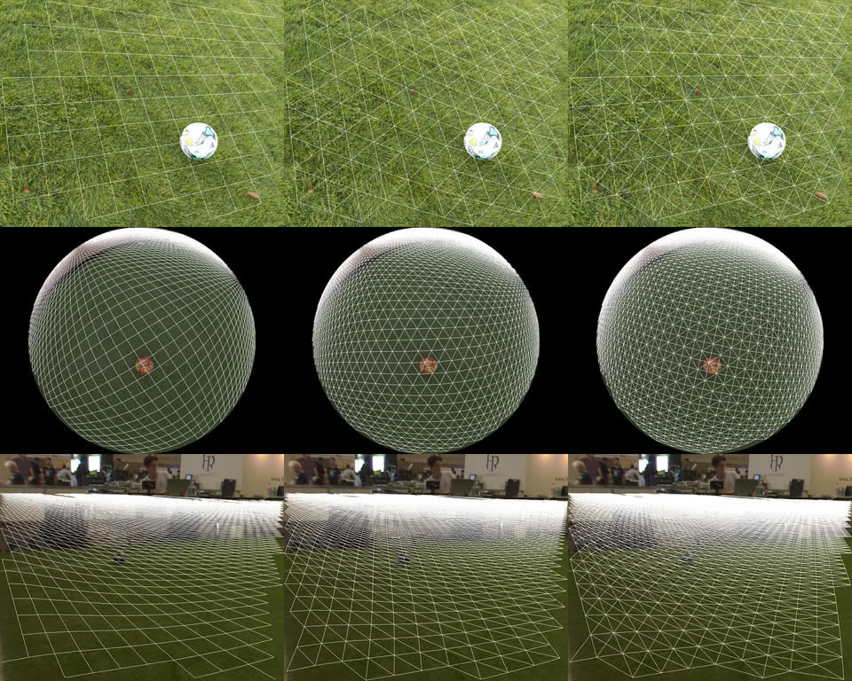

# Projection
The visual mesh projection is based on two components.
The geometry of the object that we are looking at and the geometry of the mesh that we view it through.
Ideally the visual mesh would give a perfect regular covering of the target geometry.
However the geometry of some of the shapes such as spheres do not give a flat geometry.
This makes it impossible to design a sampling that is both consistent in the number and position of points.
Fortunately the neural networks are able to continue to function with these distortions provided they are not significant.
To account for this, several different models have been developed to try to preserve different properties.

Whether you use are polar or cartesian coordinate system to present the points to the mesh makes a significant difference in how the network is able to perform.
Polar networks such as Ring and Radial work well for Ground networks where you are looking at objects at a distance.
In these systems having further in distance be a consistent direction in the graph means orientation of upright objects is preserved.
Cartesian networksGrid networks

## Dataset Keys
```python
"lens/projection": bytes[1] # ['RECTILINEAR' | 'EQUISOLID' | 'EQUIDISTANT']
"lens/focal_length": float[1]
"lens/fov": float[1]
"lens/centre": float[2]
"lens/k": float[2]
```

## Configuration
```yaml
projection:
  type: VisualMesh
  config:
    # The type of mesh we are using
    mesh:
      # The type of Visual Mesh we are generating
      model: RING6
      # How many distinct meshes to cache before dropping old ones
      cached_meshes: 100
      # The maximum distance the Visual Mesh will be projected for.
      # This should be slightly further than the most distant object
      # you wish to detect to account for noises in the projection.
      max_distance: 20
    # The geometry of the object we are detecting in the Visual Mesh.
    geometry:
      # The shape to project, either CIRCLE or SPHERE.
      shape: SPHERE
      # The radius of the object to be detected.
      radius: 0.0949996
      # How many intersections with the target object we should have.
      intersections: 6
      # How many intersections the mesh can vary by before it will generate a new mesh
      intersection_tolerance: 0.5
```

## Geometry
These geometry models are based on one or both of two properties of the objects.
Firstly is the `n` distance metric.
This metric is defined as the number of objects that you would have to stack without overlapping in the camera's view to get between two points.
The second is the angle that is subtended from the point of view of the camera for points at a constant distance.

### Sphere
The `n` metric for spheres is based on the positions of the tangents in a sphere.
`n=0` is defined as the point at which a sphere is directly below the camera.

The `θ` metric is calculated using the tangents to the elliptical shadow that the sphere casts when viewed from the camera.
The tangents to this ellipse happen to be identical to the shadow of the sphere from above.



### Circle
The `n` metric for circles is based on increasing radius of the circles on the ground.
It forms a flat planar space and therefore standard 2d tessellations work on it.
`n=0` is defined when the circle is directly below the camera

The `θ` metric is calculated using the tangents to the circle from above.



## Mesh Models
Mesh models are used to generate the graph structure for the visual mesh.
All models will have some form of error depending on how it was constructed.
Each of the models has three versions determined by the number of neighbours it has.
Four node versions (`RING4`, `XYGRID4` etc) are connected to neighbours in a `+` pattern.
Six node versions (`RING6`, `XYGRID6` etc) are connected to neighbours in a hexagonal pattern.
Eight neighbour versions (`RING68`, `XYGRID8` etc) are connected to all the nodes that would form a 3x3 grid.
```
   4         6        8

   X       X   X    X X X
   |        \ /      \|/
X--X--X   X--X--X   X-X-X
   |        / \      /|\
   X       X   X    X X X
```
In the images that are shown below, each node displays it's connection to another with a line that is half the distance to that node. If that node also connects back it will form a complete line.
When the connection is only one way, you will see half a line shown.

### Ring
The ring networks are built using concentric rings where each node is connected to the nodes to its left and right in the same ring, and nearest nodes in the previous and next ring.
This is the traditional visual mesh model as first proposed.

#### Errors
- Significant distortion at the origin where the singularity causes the inputs to be highly distorted.
- Increased size of the previous/next ring are not fixed multiples which result in occasional X shapes due to misalignment.
- Following the graph outward will result in arc shapes in some areas.



### Radial
The radial model is designed to provide a better global radial property to the ring model.
In this model following the graph outward will better approximate a linear increase in distance without curving.
However as a result of trying to maintain this property the distance between nodes is much more variable.
The result of this is that the graph has better preserved global properties at the expense of local distortions.
This model can be better when you are using deeper networks and looking at larger objects.

#### Errors
- Significant distortion at the origin where the singularity causes the inputs to be highly distorted.
- Increased size of the previous/next ring are not fixed multiples which result in occasional X shapes due to misalignment.
- Significant local distortion in the graph due to the enforcement of the radial outward property.



### XY Grid
The XY grid is built by taking plane slices along two orthogonal axes.
These plane slices are calculated using the number of object `n` jumps.
This method gets significant errors as you get further away from the origin as the angle of objects near the origin on one axis is very inaccurate once you move away.
However, the angle is maintained very well at the cost of object scale not being maintained with distance.

#### Errors
- Significant errors away from the origin due to scaling
- Errors get worse the further you are from either axis making diagonals even more inaccurate



### XM Grid
XM Grid is an attempt to improve the XY grid by making the second axis depend on the distance from the origin.
It makes slices along the X axis by jumping object distances just like in XY grid.
However, for the Y axis, it calculates this by calculating the jump within the plane defined by the X value.
The result of this is that although the X axis is scaling too fast, the Y axis does not suffer this problem.
It suffers from similar problems as the NM Grid, however not quite as bad so it might still be usable in the right circumstances.



### NM Grid
This model is here as a warning so that when you come up with this idea in the future you know it is a dead end.
One day you will think you have a great idea how to solve the visual mesh graph problem.
If you took one axis, and then calculated
What you will realise if you try it is that on the diagonals you must stretch your square grid until the lines are almost parallel.
Once your X and Y axes are travelling in almost the same direction you end up with a useless grid.

#### Errors
- On the diagonals with very little distance the density increases to absurd levels
- On the diagonal angles become highly distorted resulting in odd shapes


