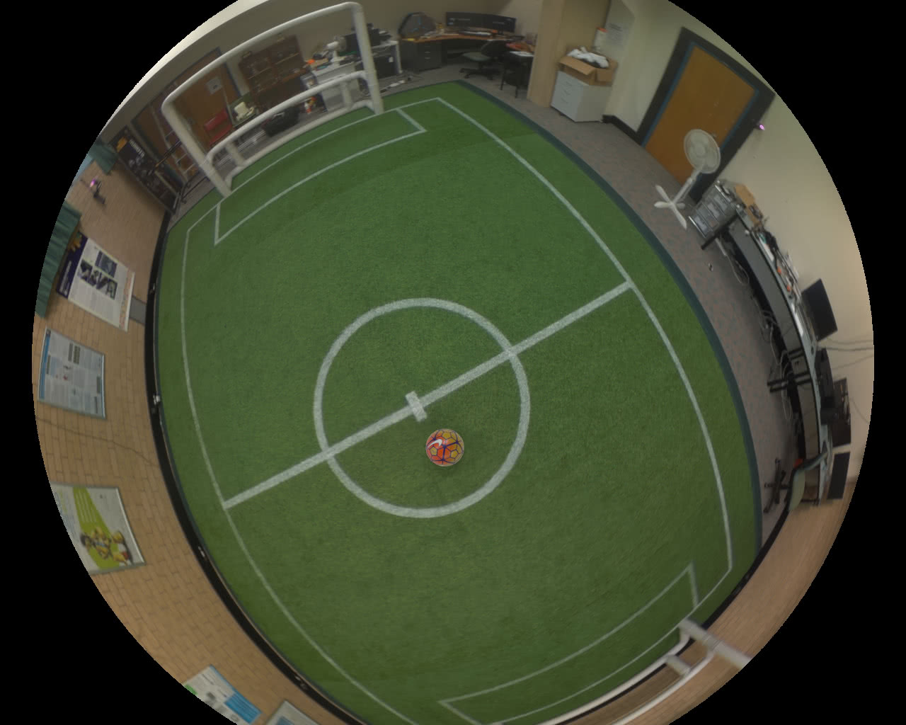
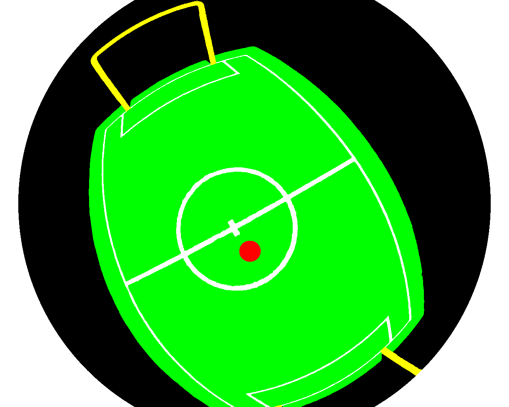

# Quickstart Guide

This guide is designed to get a classification network training for your dataset asap.
If you need something more specific read through the rest of these readmes and feel free to ask on Gitter [](https://gitter.im/Fastcode/VisualMesh?utm_source=badge&utm_medium=badge&utm_campaign=pr-badge&utm_content=badge).

This guide assumes you're using docker and have already installed it.

## Setting up
To setup with docker once you have docker installed all you need to do is build the docker image.
```sh
docker build . -t visualmesh:latest
```

## Making a dataset

### Gathering the data
Create a folder that contains your source training data.
You will need three files per image:

|`imageX.jpg`|`maskX.png`|
|:-:|:-:|
|| |
**Lens.yaml**
```yaml
projection: EQUISOLID
focal_length: 420
centre: [0, 0]
k: [0, 0]
fov: 1.80248
Hoc:
  - [-0.244225, -0.905877, 0.346036, 0]
  - [-0.0304556, 0.363831, 0.930967, 0]
  - [-0.96924, 0.216827, -0.116446, 0.8]
  - [0, 0, 0, 1]
```

- **`Hoc`** is a homogenous transformation matrix which if used like `Hoc * (a,b,c,1)` would convert a vector in the cameras coordinate system into one from the ground.
In this matrix, only the z component of translation matters (the cameras height above the ground).
```
┌            ┐
│          0 │
│    R     0 │
│          z │ <- Only Z is important for the visual mesh
│ 0  0  0  1 │
└            ┘
```
- **`projection`** is either `RECTILINEAR`, `EQUISOLID` or `EQUIDISTANT` depending on the lens used in the camera.

- **`focal_length`** is the focal length of the camera measured in pixels.

- **`centre`** is the offset from the centre of the lens, to the centre of the image in pixels.
If you don't know set it to `[0, 0]`

- **`k`** is the two component radial distortion values for the lens as per a polynomial series.
If you don't know set it to `[0, 0]`

- **`fov`** is the field of view of the camera, for many rectilinear lenses it will be the full field of view, but for lenses with black circles (like above) it will be less.

### Building the dataset
Once you have these in a folder make sure they are named `imageX.jpg`, `maskX.jpg` and `lensX.yaml` where `X` is replaced with a unique number per example.

You can then run
```sh
./training/build_dataset.py <path/to/images> <path/to/output>
```
and it will create a training, validation and testing TFRecord file containing the data.

## Training
In order to do training you must create a configuration file.
To start with you can copy `example_net.yaml`.
You must place this configuration file and put it in the output folder.
For example, copy over `example_net.yaml` to `output/quickstart/v1/config.yaml`

Running the following command will then begin training the network.
```sh
./docker run --gpus all -u $(id -u):$(id -g) -it --rm --volume $(pwd):/workspace visualmesh:latest ./mesh.py train <path/to/output>
```

## Testing
Once your network has trained you are able to run the following command to test the network.
```sh
./docker run --gpus all -u $(id -u):$(id -g) -it --rm --volume $(pwd):/workspace visualmesh:latest ./mesh.py test <path/to/output>
```
It will measure several properties of the network and output them to the output directory.
